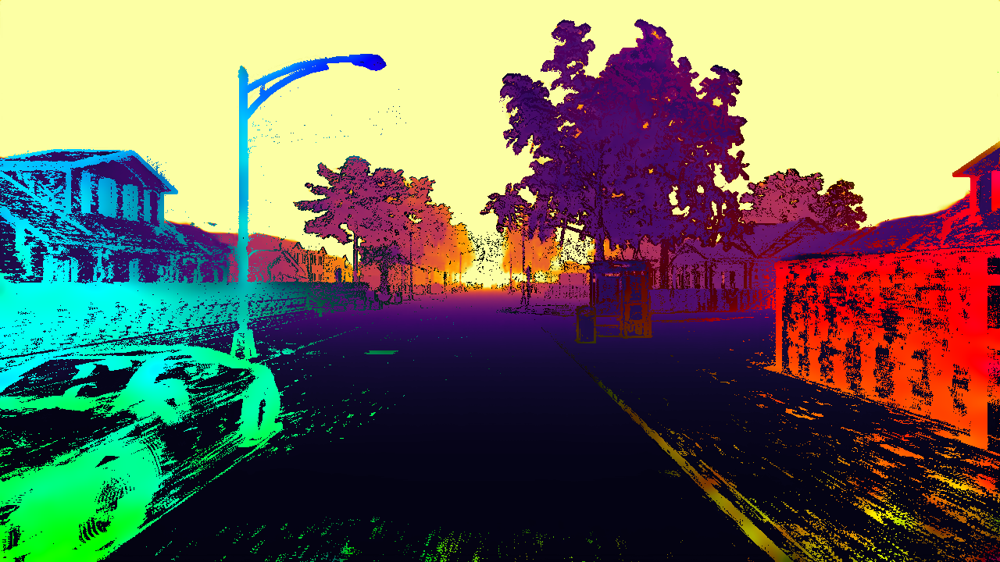

# Multimodal Estimation of Movement and Depth Based on Events for Scene Analysis



This repository holds the LaTeX code for generating the PDF file of the "Multimodal Estimation of Movement and Depth Based on Events for Scene Analysis" thesis, written by Vincent Brebion and defended in January 2024.\
If you want to read the thesis directly, the pre-compiled PDF is available [here](https://vbrebion.github.io/PHD).

If you use this document as part of your work, please cite:

```BibTeX
@phdthesis{Brebion2024MultimodalEO,
  title={Multimodal Estimation of Movement and Depth Based on Events for Scene Analysis},
  author={Vincent Brebion},
  school={Université de technologie de Compiègne},
  year={2024},
  month={January},
  type={PhD thesis}
}
```

## Abstract

Event cameras open new perception capabilities, allowing for the analysis of highly dynamic scenes with complex lighting. In the context of this thesis, two low-level perception tasks were examined in particular: (1) optical flow and (2) depth estimation.

In the case of optical flow, an optimization-based approach was developed, allowing for the estimation of optical flow in real-time with a single high-resolution event camera. Our approach provides accurate results, and was at the time of publishing the only event-based optical flow method working in real-time with high-resolution event cameras.

As for the depth estimation, a learning-based data-fusion method between a LiDAR and an event camera was proposed for estimating dense depth maps, in the form of a convolutional neural network (ALED). A novel notion of "two depths per event" was also proposed, as well as a novel simulated dataset containing high-resolution LiDAR, event data, and perfect ground truth depth maps. Compared to the state of the art, an error reduction of up to 61% was achieved, demonstrating the quality of the network and the benefits brought by the use of our novel dataset.

An extension to this depth estimation work was also proposed, this time using a recurrent attention-based network (DELTA) for a better modeling of the spatial and temporal relations between the LiDAR and the event data. Compared to ALED, DELTA is able to improve results across all metrics, and especially for short ranges (which are the most critical for robotic applications), where the average error is reduced up to four times.

## Build

This thesis was originally compiled with [TeX Live](https://www.tug.org/texlive/) 2019. More recent releases should also be compatible, but were not tested.

To build it by yourself, first clone the repo and its submodules:

```bash
git clone --recursive https://github.com/vbrebion/phd_thesis_brebion.git
```

And then build it using `latexmk`:

```bash
cd phd_thesis_brebion
latexmk
```

Once done, the compiled `root.pdf` file can be found in the `out/` folder.

## Copyright

This thesis and all its figures and tables are published under the Creative Commons Attribution (CC BY) 4.0 International license.\
This means that you can share and adapt this work, as long as you give appropriate credit, provide a link to the license, and indicate if changes were made.
